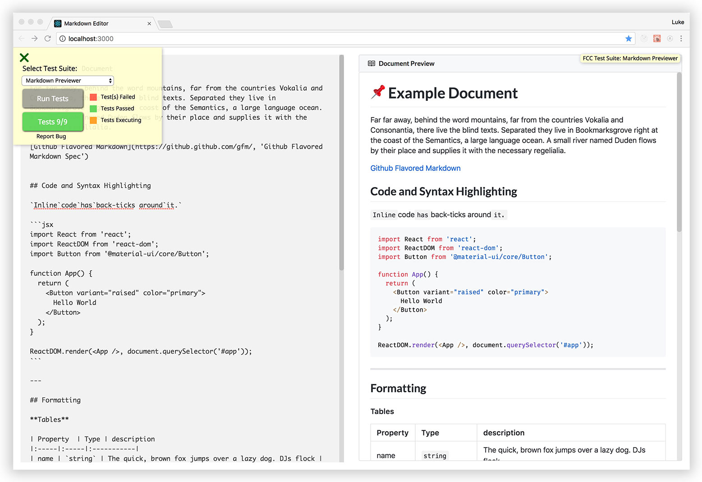

# [FCC Project: Markdown Editor](https://learn.freecodecamp.org/front-end-libraries/front-end-libraries-projects/build-a-markdown-previewer)

A simple markdown editor that shows a live preview of the markdown document.

__[Project Specifications](https://learn.freecodecamp.org/front-end-libraries/front-end-libraries-projects/build-a-markdown-previewer/)__:

1. ✔️ Renders a `textarea` with the id "editor".

2. ✔️ Renders another element with the id "preview"

4. ✔️ The user can enter GitHub Flavored Markdown in the `#editor` element, and it is rendered as HTML which is displayed in the `#preview` element.

3. ✔️ `#preview` is updated every time the text in `#editor` changes. So the preview should automatically update as the user types

5. ✔️ When the app first loads, the default content in the `#editor` field should be valid markdown that contains at least one of the following: heading 1, heading 2, link, inline code, code block, ordered list, unordered list, blockquote, image, and bolded text.

6. ✔️ When the app first loads, the default markdown in the `#editor` field should be rendered as HTML in the `#preview` element.

7. ✔️ If the user clicks on a link in the rendered markdown document it should always open in a separate tab

8. ✔️ The markdown previewer interprets carriage returns and renders them as ` `.

---

[__Live Demo__](http://fcc-markdown-editor.surge.sh/):

